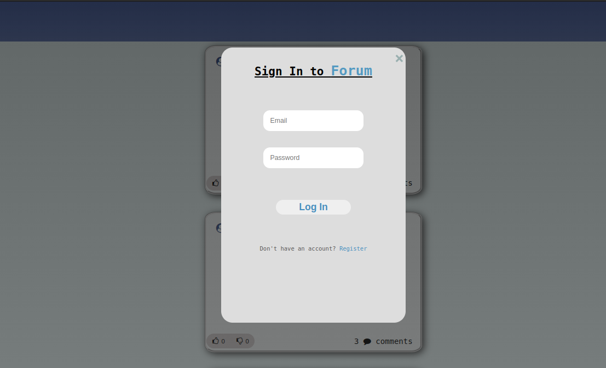
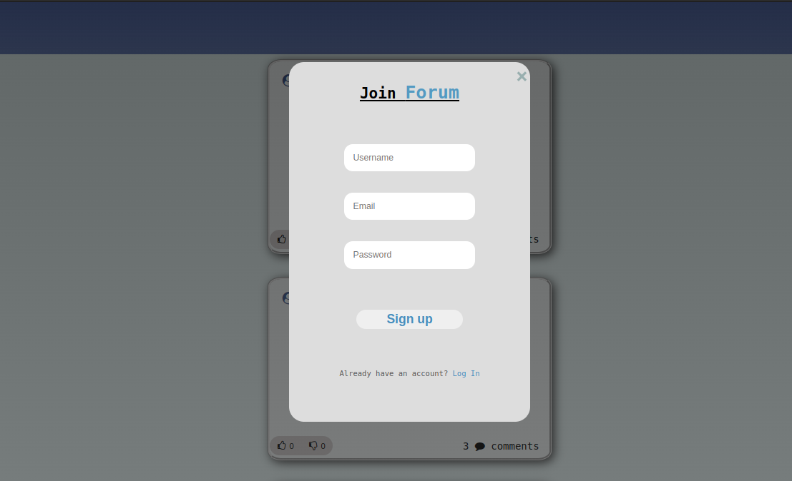
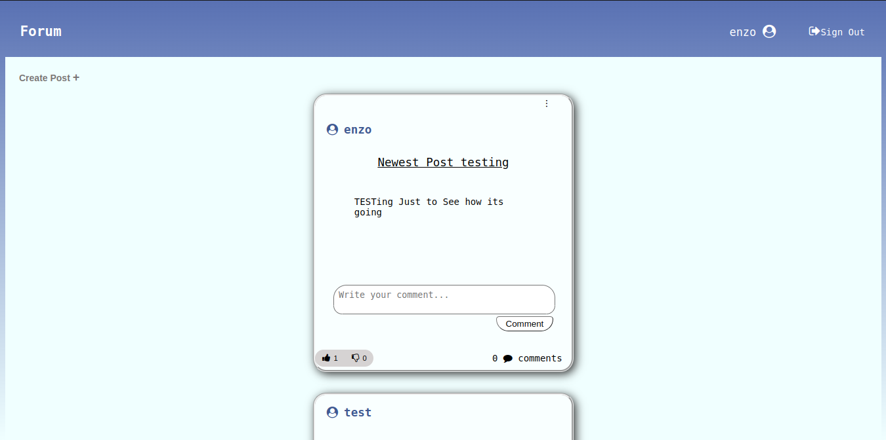

# Forum

This project is a web app forum where users can create accounts and log in; they can then post, like or dislike the posts, and comment as well as like or dislike the comments.

Here's an image of the home page without logging in:

Here's the pop up on which users can log in:

Here's the pop up on which the users can sign up:

Here's the home page after logging in:

If you wish to try it out, clone the repository and run it with the command 'go run main.go'