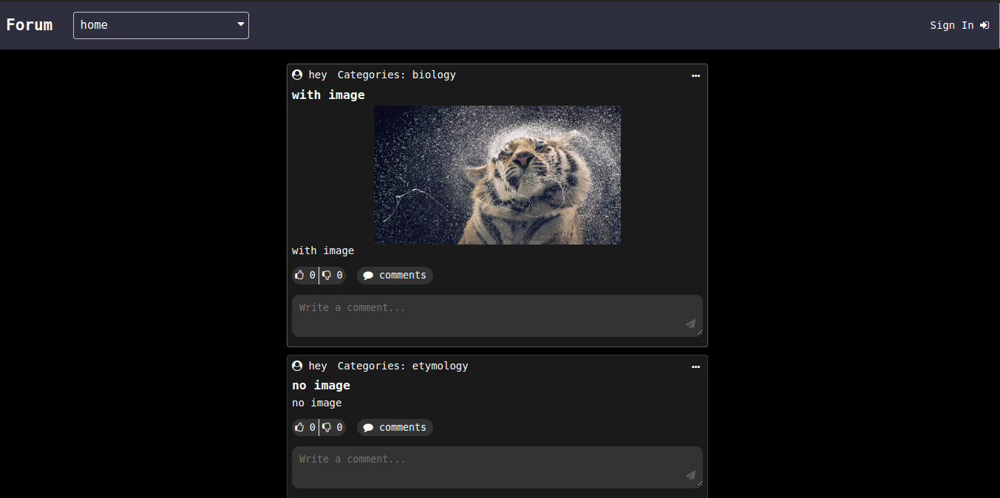

# Forum

This project is a web app forum where users can create accounts and log in; they can then post, like or dislike the posts, and comment on them.

Here's an image of the home page:

The home page contains a navigation bar that gives access to the other pages, as well as a search bar and a filter that allows you to filter through categories.

Here's an image of the users page:

On this page users can comment, like and dislike, as well as post stuff.

Here's an image of the sign in page:

On this page users can create an account or login.
